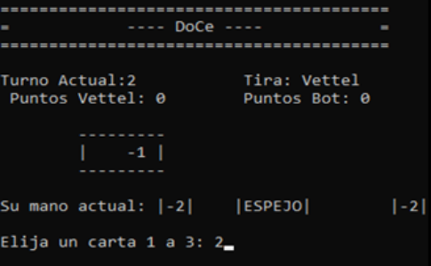
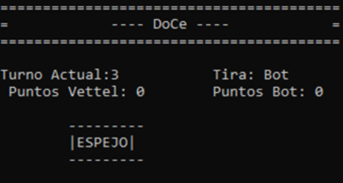
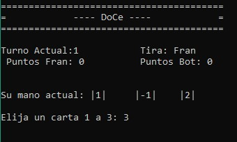
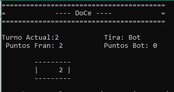
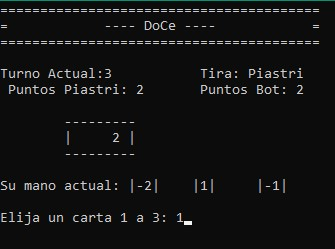
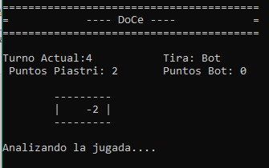
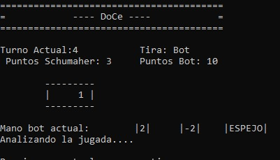
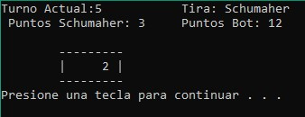

# Pruebas del Proyecto DOCE

Descripcion|Salida Esperada| Salida Obtenida
:-----:|:-----:|:-----:
Se lanza una carta de resta de puntos al bot (-2,-1) si este antes de lanzar la carta no tiene puntos y luego de tirada la carta el bot tira una carta espejo no se le deben sumar puntos al bot|Se espera que al tirar una carta negativa a un jugador con cero puntos el puntaje quede en cero, y a su vez si se tira una carta espejo  no se sumen puntos,ya que, si no se restaron no se deberían sumar.|
Si el jugador tira una carta de sumar puntos(+1,+2) se deberá incrementar su puntaje actual|Inicia la partida, ambos tienen puntaje 0.El jugador “fran” tiene las cartas(1) (-1) (2). y juega primero, elige jugar la carta (2) y obtiene dos puntos.| 
Si el jugador tira una carta de restar puntos(-1,-2) se deberá restar el  puntaje actual del bot|El bot tiene 2 puntos y el jugador “Piastri” tiene en su mano las cartas -2 1 -1. Se espera que al seleccionar la carta -2 se le resten 2 puntos al bot y sus puntos actuales queden en 0.| 
Nivel de juego[Medio] si el bot tiene[8-9] puntos deberá priorizar cartas que incremente su puntaje (+2,+1)|El bot tiene más de 8 puntos y en la mano tres tipos de cartas distintas. Se espera que en la dificultad media el bot elija sumar puntos por encima de aplicar algún efecto.| 
Cuando el jugador u bot tiran la carta “repetir” deberán mantener su turno y jugar otra carta|Se espera que al tener una carta Repetir en mano y lanzarla, el turno avance, pero pueda volver a tirar el mismo jugador en otro turno.|
Cuando el jugador u bot tiran la carta “espejo” si la carta anterior es negativa se le resta puntos al adversario y se le suma al tirador|Se espera que si la carta en la mesa es -1 o -2, y automáticamente después se tira una carta espejo el efecto negativo se aplique a quien tiró dicho efecto, y se sumen los puntos restados al tirador de la carta espejo.|
La función ver ranking deberá mostrar lo que se ve en la  página ||
Juego nivel [Difícil]: Si el jugador está cerca de ganar,el bot prioriza cartas de “repetir turno” o “sacar puntos”.|Se espera que si el jugador está cerca de ganar y el bot tiene en su mano cartas de repetir o restar puntos las priorice.|